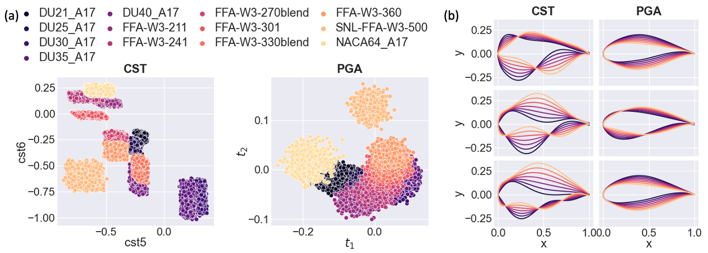
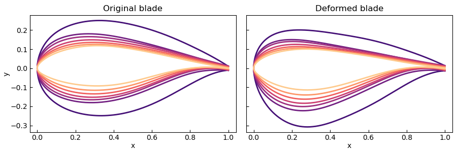

# Summary

`G2Aero` is a Python package for the design and deformation of planar curves and surfaces using a geometric data-driven approach. `G2Aero` utilizes a topology of product manifolds: the Grassmannian, $\mathcal{G}(n,2)$---the set of $2$-dimensional subspaces in $\mathbb{R}^n$---and SPD manifold, $S^2_{+ +}$---the set of $2\times 2$ symmetric positive-definite (SPD) matrices.

The package provides a novel framework for representing separable deformations to shapes, which consist of stretching, scaling, rotating, and translating---also known as affine deformations---and the remaining deformations---which we refer to as undulation-type deformations.

We focus on airfoil and blade design applications to emphasize the utility of the methods in an environment where the separation of affine and undulation-type deformations is critical. Notable functionalities of the framework for blade design include:  

1) generating novel airfoil shapes informed by a database of physically relevant airfoils, 
2) building 3D blades by interpolating sequences of 2D airfoil cross-sections, 
3) generating blades with consistent perturbations along the blade span.

\autoref{fig:wire_frame} shows the wire frame obtained by interpolating airfoils defining the IEA 15-MW wind turbine blade [@IEA15MW] and applying affine transformations corresponding to twist, chordal scaling, and bending. This and all other figures in the paper can be reproduced by following examples and documentation tutorials provided within `G2Aero` package.

{ width=100% }

# Statement of need

Aerodynamic shape design is a capstone problem in engineering and manufacturing that continues evolving with modern computational methods and resources. Many design and manufacturing algorithms rely on shape parameterizations to manipulate shapes to control and measure manufacturing and/or damage variations, develop surrogates, study sensitivities, approximate inverse problems, and inform optimizations. 

Two-dimensional cross-sections of aerodynamic structures such as intake passages, exhaust nozzles, bypass ducts, wings, gas turbine engine blades/vanes, and wind turbine blades are critical engineering shapes for aerospace and energy industries. Specifically, blade and wing design involves designing airfoils (2D cross-sections of a blade/wing) to improve aerodynamic, structural, and acoustic performance. Applying AI and ML algorithms to airfoil design is a rapidly growing area of research [@Li:2022]. Providing a shape parametrization method that improves the parameter domain for AI and ML algorithms may significantly improve the results.

{ width=60% }

## Comparison with existing methods
There are a wide range of methods to represent airfoil geometry [@masters2017]. These methods vary from general geometry representation such as B-splines [@Hosseini2016] to parametric methods specific to airfoil shapes such as PARSEC [@sobieczky1999].
The current state-of-the-art method for airfoil shape parametrization is the class-shape transformation (CST) [@kulfan2008universal]. The parameters in this representation are coefficients of a truncated  Bernstein polynomial expansion, and tuning them enables designers to define new airfoil shapes.

Usually, to generate new airfoils, researchers perturb CST coefficients of baseline airfoils (existing well-studied airfoils) by up to 15-20% [@glaws2022scitech; @grey2018active; @Glaws:2022]. But it can be challenging to define a broader, more general design space to generate new types of airfoils, e.g., using several baseline airfoils results in a very complicated and disconnected CST design space (see \autoref{fig:cst_vs_pga}). Shape parametrization used in `G2Aero` is based on principal geodesic analysis (PGA) over the Grassmannian; it allows us to define an **improved low-dimensional parameter domain** for design and manufacturing algorithms. A random parameter sweep over the CST domain may produce non-physical airfoil shapes, while a random parameter sweep over the PGA domain results in "reasonable" (well-regularized) airfoils (\autoref{fig:cst_vs_pga_sweeps}).

The CST method (and other expansion representations) often couples linear scaling of the shape (affine-type deformations) and smaller-scale undulating perturbations. Affine-type deformations---like changes in thickness and camber---result in relatively well-understood physical impacts on aerodynamic performance, while smaller-scale undulating perturbations are of increasing interest to airfoil design [@glaws2022scitech; @grey2018active]. `G2Aero` **decouples linear scaling and undulations** by defining undulation-type deformations as the set of all deformations modulo linear scaling of the discrete curves. Because of this separability, we can independently study the effect of smaller-scale undulating perturbations---for example, manufacturing defects and damage.

Blade surfaces are generally defined by an ordered set of cross-sectional airfoils at different blade-span positions from hub to tip paired with profiles of twist, chordal scaling, and translation (bending). It can be challenging to smoothly interpolate these 2D cross-sections along the span of the 3D surface. Current approaches often require significant hand-tuning of airfoil shapes to construct valid blade geometries without "dimples" or "kinks" in the blade's surface. The chordal scaling profile represents linear deformations and is often tightly regulated by the operational conditions of the blade. Our separable treatment of linear scaling and smaller-scale undulations enables surface interpolation, which is independent of these prescribed linear deformations and **generates more reliable/robust surface geometries**.

Moreover, the number of parameters required to define an individual blade scales by the total number of designed cross-sections. For example, a wind turbine blade may be composed of eight to ten airfoil shapes along its span such that the total parameter count for the blade is an order of magnitude larger than the number of individual parameters defining an airfoil. Assuming each airfoil is defined independently, this could amount to hundreds of parameters required to represent a single blade shape with the vast majority of parameter combinations resulting in non-physical designs. `G2Aero` significantly **reduces the total number of parameters** by using parallel translation over the PGA domain to consistently perturb interpolated 2D shapes for 3D surface design (\autoref{fig:perturbed_blade}).

# Methods
`G2Aero` implements the novel separable tensor framework outlined in detail in @Grey:2023. It is designed to learn matrix-submanifolds, generate novel shapes localized to data, control shape undulations by truncating an ordered basis of deforming modes, and enable a novel notion of "consistent deformations" as an approach to regularized surface design.

Specific methods within `G2Aero` include: 

- principal geodesic analysis (PGA) over normal coordinate neighborhoods of matrix manifolds (a generalization of Principal Component Analysis),
- working over product submanifolds of the Grassmannian and SPD, $S^2_{+ +}$, matrix manifolds,
- Riemannian interpolation connecting a sequence of 2D cross-sections to build 3D swept surfaces from data,
- parallel translation over inferred PGA domain to perform consistent perturbations over the span of interpolated 2D shapes for 3D surface design. 

# Current capabilities and applications
### 1) Generating airfoil shapes

`G2Aero` defines an improved parameter domain inferred from a database of relevant shapes (discrete 2D curves). This domain independently treats affine and undulating type deformations, allowing for more targeted shape design and generation of a rich set of novel 2D deformations. Using PGA over the Grassmannian significantly reduces the dimensionality of the parameter domain; we found that we can use as few as four PGA parameters to represent a wide range of undulation-type deformations of the shape and three parameters to represent linear deformations.

In @Doronina:2022 we shortly summarized the framework and demonstrated advantages of an improved parameter domain for ML/AI algorithms.
@zhang2022aerodynamic tested Grassmannian shape representation and showed that it is very robust for airfoil shape optimization. @jasa2022wind used generated airfoils coupled with NREL’s Wind-Plant Integrated System Design Engineering Model (WISDEM&#174;) [@wisdem] to design blade shapes with reduce costs of energy compared to traditional design methods.

### 2) Building 3D blades by interpolating 2D airfoil cross-sections

We use piecewise geodesic interpolation to connect a sequence of 2D cross-sections and build 3D swept surfaces from data. Our separable treatment of linear scaling and smaller-scale undulating deformations enables the generation of more reliable/robust swept surface geometries independent of often fixed operation conditions (twist, chord scaling, and bending of the blade). We provide an example script demonstrating how to use `G2Aero` to generate 3D CAD surface or surface mesh. We start from a yaml file in the format used to define a wind turbine blade. The blade shape definition contains ten airfoils at different blade-span positions and profiles of twist, chordal scaling, and bending. We generate 100 interpolated cross-sections defining a refined 3D surface. Then, using `Gmsh` [@geuzaine2009gmsh], we generate a 3D surface mesh shown on \autoref{fig:wind_blades}.

### 3) Generating perturbed blades

`G2Aero` achieves flexibility to generate designs in a customizable way over any portion of the blade such that deformations are independent of the deformations governing the operational conditions (twist, chordal scaling, and bending of the blade). The blade perturbation capability of `G2Aero` has been successfully used in @glaws_invertible_2022.

# Outlook and Future Work

Despite our focus on airfoil and blade design, we note obvious extensions to a variety of 2D shape applications as well as 3D shapes that are well-defined by a sequence of cross-sections, such as inlets, nozzles, ducts, passages, channels, etc. We encourage users to experiment with our package and apply methods to alternative types of shapes and surfaces.  Our computationally efficient approach to matrix-manifold learning and generative modeling of discrete planar curves may offer advantages in applications beyond aerodynamics, where learning a non-linear topology of shapes from data may be impactful.

# Acknowledgments

This work was authored in part by the National Renewable Energy Laboratory, operated by Alliance for Sustainable Energy, LLC, for the U.S. Department of Energy (DOE) under Contract No. DE-AC36-08GO28308. Funding is partially provided by the Advanced Research Projects Agency-Energy (ARPA-E) Design Intelligence Fostering Formidable Energy Reduction and Enabling Novel Totally Impactful Advanced Technology Enhancements (DIFFERENTIATE) program. The views expressed in the article do not necessarily represent the views of the DOE or the U.S. Government. This work is U.S. Government work and not protected by U.S. copyright. A portion of this research was performed using computational resources sponsored by the Department of Energy's Office of Energy Efficiency and Renewable Energy and located at the National Renewable Energy Laboratory.

# References  
